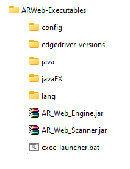
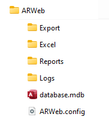

# INSTALLATION GUIDE

## System Name
**AR Scanner**

## Installation Steps

1. **Unzip Files**
   - Extract all files into a folder of your choice.

2. **Folder Structure**
   - Open the folder after extraction.
   - Ensure the directory structure matches the example below:

     **Example:**
   
     

   - Create the necessary Database and Logs/Reports folder structure as shown:

     

3. **Modify Configuration**
   - Edit the file `exec_launcher.bat` to update the folder path according to your setup.
   - Update the `SET PATH` variable in `exec_launcher.bat` as needed. For example:
     
     **Default:**
     ```
     SET PATH=C:\Program Files\ARWeb;C:\Program Files\ARWeb\java\bin;C:\Program Files\ARWeb\javaFX;C:\Program Files\ARWeb\javaFX\lib;%PATH%
     ```
     **Custom Example:**
     ```
     SET PATH=D:\Projects\AllinWeb\ARWeb-Executables;D:\Projects\AllinWeb\ARWeb-Executables\java\bin;D:\Projects\AllinWeb\ARWeb-Executables\javaFX;D:\Projects\AllinWeb\ARWeb-Executables\javaFX\lib;%PATH%
     ```

   - Also, ensure the correct path is set for `ARWeb.config`. If you have placed it in a different folder, update the reference accordingly:
     ```
     "D:\Projects\AllinWeb\ARWeb\ARWeb.config"
     ```

## Notes
- Ensure all paths are correctly set in `exec_launcher.bat` before running the system.
- Verify that the required folder structure exists before execution.

---

**End of Installation Guide**

