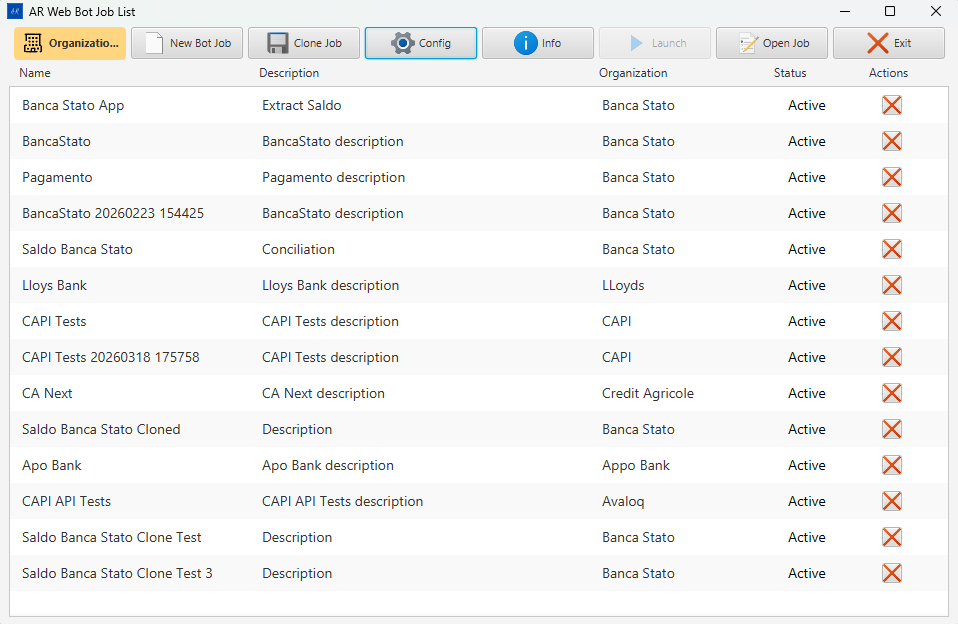
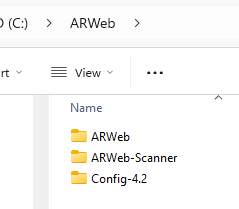
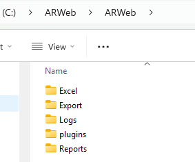
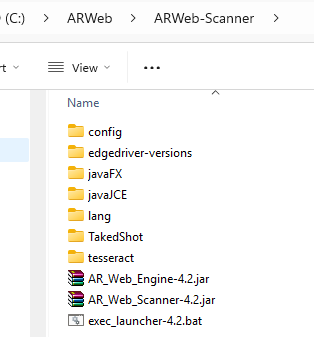
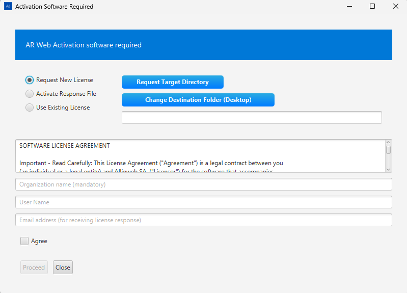
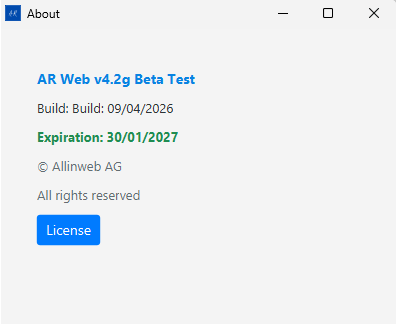
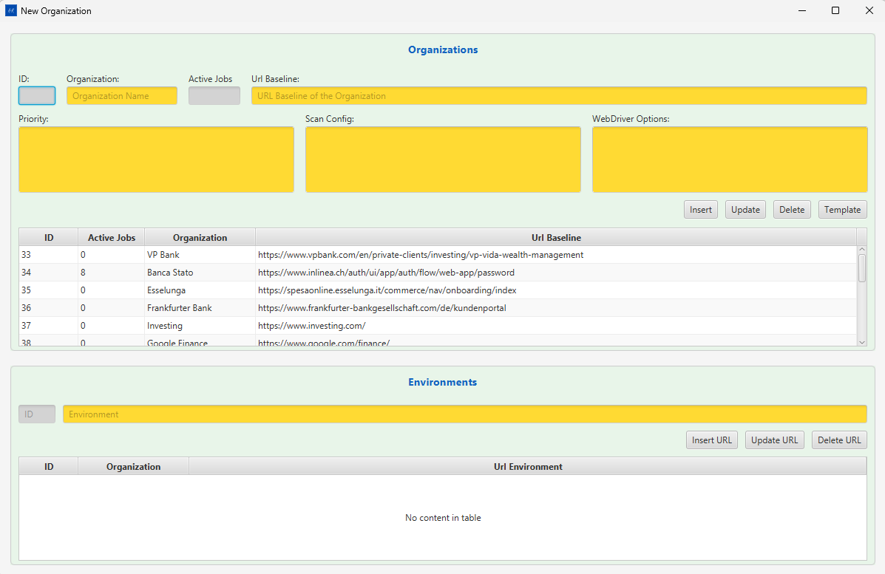
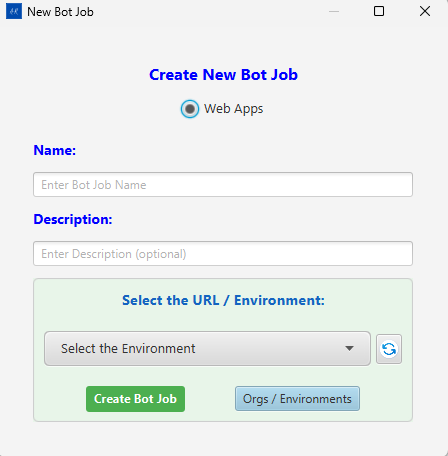
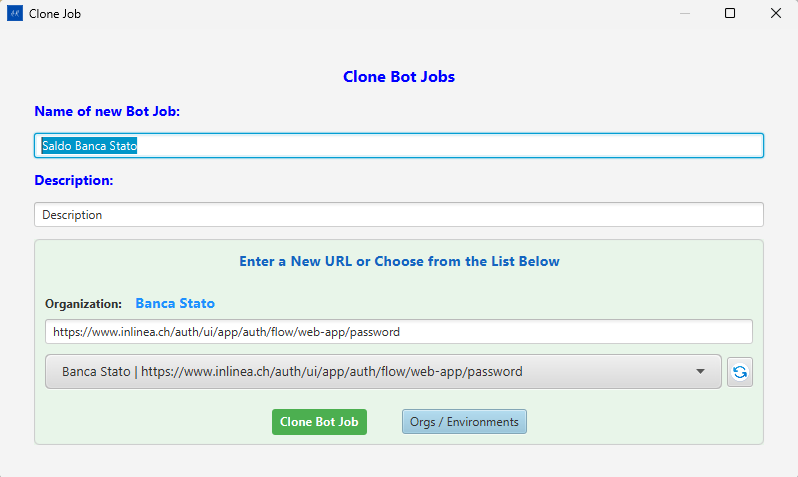

# AR Web Scanner — User Guide Part 1: Desktop Application

> **Version:** 4.2 | **Audience:** QA Engineers, Automation Authors
>
> This guide covers the **AR Web Scanner** JavaFX desktop application — the authoring tool used to record and manage automation bot jobs.
>
> **Part 2** covers the Bot Job View and AR Web Factory in depth.
>
> Screenshots are embedded from `specifications/screenshots/`.

---

## Table of Contents

1. [Overview](#1-overview)
2. [Installation](#2-installation)
   - [Root Folder Structure](#root-folder-structure)
   - [ARWeb — Runtime Data Folder](#arweb-runtime-data-folder)
   - [ARWeb-Scanner — Application Folder](#arweb-scanner-application-folder)
   - [Launcher Script — exec_launcher-4.2.bat](#launcher-script--exec_launcher-42bat)
   - [Config-4.2 — Configuration Folder](#config-42-configuration-folder)
3. [Prerequisites & First Launch](#3-prerequisites--first-launch)
4. [Main Window](#4-main-window)
5. [Organizations](#5-organizations)
6. [Configuration Panel](#6-configuration-panel)
7. [Bot Job List](#7-bot-job-list)
8. [Creating a Bot Job](#8-creating-a-bot-job)
9. [Opening a Bot Job (Bot Job View)](#9-opening-a-bot-job-bot-job-view)
10. [Scanner — Picking Web Elements](#10-scanner--picking-web-elements)
11. [Scanner Grid — Managing Scanned Elements](#11-scanner-grid--managing-scanned-elements)
12. [Generating the Excel Data File](#12-generating-the-excel-data-file)
13. [How Bot Job Execution Works](#13-how-bot-job-execution-works)
    - [The Big Picture](#the-big-picture)
    - [Structure of a Bot Job](#structure-of-a-bot-job)
    - [The Execution Loop](#the-execution-loop)
    - [Step-by-Step Execution Flow](#step-by-step-execution-flow)
    - [How the Engine Finds Elements](#how-the-engine-finds-elements-on-the-page)
    - [Conditional Logic — IF, LOOP, GOTO](#conditional-logic--if-loop-goto)
    - [Launch vs Pre-Launch](#launch-vs-pre-launch--same-logic-different-context)
14. [Launch — Running the Automation Engine](#14-launch--running-the-automation-engine)
15. [Pre-Launch (Batch inside Scanner)](#15-pre-launch-batch-inside-scanner)
16. [Clone a Bot Job](#16-clone-a-bot-job)
17. [Export / Import a Bot Job](#17-export--import-a-bot-job)
18. [Reports](#18-reports)
19. [Backup & Restore](#19-backup--restore)
20. [OCR Element Recognition](#20-ocr-element-recognition)
21. [Troubleshooting](#21-troubleshooting)

---

## 1. Overview

AR Web Scanner is a Windows desktop application that lets automation engineers:

- **Record** the web elements (buttons, inputs, links, labels) of a banking or web portal.
- **Organize** recorded elements into named **Bot Jobs** grouped inside **Organizations**.
- **Drive** a Chrome/Edge/Firefox browser via Selenium to verify elements work correctly before saving them.
- **Generate** an Excel data file required by the automation engine.
- **Launch** the **AR Web Engine** (a separate Java JAR) that replays the recorded actions in batch mode.



---

## 2. Installation

AR Web Scanner is distributed as a pre-packaged folder set. No installer wizard is needed — simply copy the provided folders to the target machine and run the launcher script.

### Root Folder Structure

The installation is placed under a single root folder (e.g., `C:\ARWeb\`):



| Folder | Purpose |
|---|---|
| `ARWeb\` | Runtime data folder — created and managed by the application at runtime |
| `ARWeb-Scanner\` | Application folder — contains the JAR files, Java runtime, drivers, and launcher |
| `Config-4.2\` | Configuration folder — contains `ARWeb.config` with all runtime settings |

---

### ARWeb (Runtime Data Folder)



| Sub-folder | What gets written here |
|---|---|
| `Excel\` | Excel data files (one `.xlsx` per bot job, used by the Engine) |
| `Export\` | Exported bot job bundles (ZIP/JSON created by **Export Job**) |
| `Logs\` | Engine log files (`engine_debug_log_output.log`, `engine_debug_log_error.log`, `engine_debug_log_input.log`) |
| `plugins\` | Minified JavaScript plugins injected into the browser (`hoverPick.min.js`, `actionExecutor.min.js`, `searchListAsync.min.js`) |
| `Reports\` | HTML and CSV test execution reports |

> This folder does not need to be populated manually. The application creates and writes all sub-folders at runtime.

---

### ARWeb-Scanner (Application Folder)



| Item | Description |
|---|---|
| `AR_Web_Scanner-4.2.jar` | The Scanner application JAR (main executable) |
| `AR_Web_Engine-4.2.jar` | The Engine JAR — replays recorded bot job instructions |
| `exec_launcher-4.2.bat` | Windows batch launcher script (double-click to start) |
| `config\` | Internal Scanner configuration defaults |
| `edgedriver-versions\` | Bundled Edge WebDriver binaries for browser automation |
| `javaFX\` | JavaFX runtime libraries (`lib\` folder used by the launcher) |
| `javaJCE\` | Java Cryptography Extension libraries |
| `lang\` | Localisation resource files |
| `TakedShot\` | Screenshot output folder for OCR test captures |
| `tesseract\` | Bundled Tesseract OCR binaries used by the OCR feature |

---

### Launcher Script — exec_launcher-4.2.bat

Double-click `exec_launcher-4.2.bat` inside the `ARWeb-Scanner\` folder to start the application.

```bat
@echo off

REM Set base directories (relative)
SET "BASE_DIR=%~dp0"
SET "JAVA_HOME=%BASE_DIR%java"
SET "FX_LIB=%BASE_DIR%javaFX\lib"
SET "ARWEB_CONFIG=C:\ARWeb\Config-4.2\ARWeb.config"

REM Add Java to PATH
SET "PATH=%JAVA_HOME%\bin;%PATH%"

REM Change to working directory
cd /d "%BASE_DIR%"

REM Run JavaFX app
java ^
-Dfile.encoding=UTF-8 ^
--module-path "%FX_LIB%" ^
--add-modules javafx.controls,javafx.web,javafx.fxml ^
-jar AR_Web_Scanner-4.2.jar -c "%ARWEB_CONFIG%"

pause
```

The only line you may need to edit after installation is `ARWEB_CONFIG` — it must point to the correct `ARWeb.config` file for your machine. By default it points to the `Config-4.2\` folder inside the installation root.

> The script uses `%~dp0` so all other paths (Java, JavaFX, JARs) resolve relative to the script's own folder — you can move the entire `ARWeb\` tree to a different drive and it will still work, as long as `ARWEB_CONFIG` is updated.

---

### Config-4.2 (Configuration Folder)

The `Config-4.2\` folder contains `ARWeb.config` — the main settings file. It defines all runtime paths, database connection, browser selection, and per-site scanning priorities.

Key entries to verify after installation:

| Key | Example value | Description |
|---|---|---|
| `path_db` | `C:\ARWeb\ARWeb` | Root for Excel, Logs, Reports, Export |
| `path_engine` | `C:\ARWeb\ARWeb-Scanner\AR_Web_Engine-4.2.jar` | Path to the Engine JAR |
| `path_webdriver` | `C:\ARWeb\ARWeb-Scanner\edgedriver-versions\msedgedriver.exe` | WebDriver binary |
| `path_plugins` | `C:\ARWeb\ARWeb\plugins` | Folder containing the minified JS plugins |
| `path_license` | `C:\ARWeb\Config-4.2` | Folder containing the `.lic` license file |
| `database` | `SQLite` | Database engine (`Access` / `PostgreSQL` / `SQLite`) |
| `browser` | `Edge` | Browser for Selenium (`Chrome` / `Edge` / `Firefox`) |

---

## 3. Prerequisites & First Launch

| Requirement | Detail |
|---|---|
| **Operating System** | Windows 10 / 11 (64-bit) |
| **Java** | Bundled inside `ARWeb-Scanner\java\` — no separate installation needed |
| **Browser** | Edge (bundled driver in `edgedriver-versions\`) or Chrome |
| **Config file** | `ARWeb.config` in `Config-4.2\` — must be correct before first launch |
| **License file** | `.lic` file placed in the folder pointed to by `path_license` in the config |

### First Launch Steps

1. Verify `ARWEB_CONFIG` in `exec_launcher-4.2.bat` points to your `Config-4.2\ARWeb.config`.
2. Double-click `exec_launcher-4.2.bat`.
3. On first run, database migrations execute automatically — a brief delay is normal.
4. If the license file is missing or invalid, the **Activation Software Required** dialog appears.



| Option | When to use |
|---|---|
| **Request New License** | First-time installation — generates a license request file to send to Allinweb |
| **Activate Response File** | You received a `.lic` response from Allinweb — browse to it here |
| **Use Existing License** | License file already exists in `path_license` — reloads it |

5. After successful license validation the main window opens.

> **Lock file:** A `.ARWebScanner.lock` file is created in the working directory. If the application crashes and refuses to restart with a "lock file exists" error, delete `.ARWebScanner.lock` from the `ARWeb-Scanner\` folder.

---

## 4. Main Window


The main window has two areas:

1. **Top toolbar** — action buttons (described below).
2. **Bot Job List** — shows all saved bot jobs with columns: **Name | Description | Organization | Status | Actions**.

### Toolbar Buttons

| Button | Color / Style | What it does |
|---|---|---|
| **Organizations** | Gold background | Opens the Organizations & Environments manager |
| **New Bot Job** | Default | Creates a new bot job (requires at least one Organization) |
| **Clone Job** | Default | Clones the currently selected bot job |
| **Config** | Default | Opens the Configuration panel |
| **Info** | Default | Shows application version and environment info |
| **Launch** | Default | Runs the automation Engine for the selected bot job (Web App type only) |
| **Open Job** | Default | Opens the selected bot job in the Bot Job View |
| **Exit** | Default | Closes all browser sessions and exits the application |

> **Note:** The **Launch** button is disabled for Mobile bot jobs — those must be executed from AR Mobile.

#### Info Dialog

Click **Info** to open the About dialog showing the application version, build date, license expiration, and a **License** button for license management.



---

## 5. Organizations

Click **Organizations** to manage environments.



- An **Organization** represents a banking portal or web application (e.g., "Avaloq", "Temenos").
- Each Organization has one or more **Home URLs** (environments like DEV, UAT, PROD).
- You must create at least one Organization before creating a Bot Job.

### Add an Organization
1. Click **Organizations** in the toolbar.
2. Click **+ New** in the dialog.
3. Enter name and base URL.
4. Click **Save**.

---

## 6. Configuration Panel

Click **Config** in the toolbar.

> *Open **Config** in the toolbar to access this panel.*

The configuration panel stores all runtime paths and settings. Changes are written back to `ARWeb.config`.

### Path Settings

| Field | Purpose | Browse button |
|---|---|---|
| **Path Excel** | Folder where Excel data files are stored | Yes |
| **Path License** | Folder containing the `.lic` license file | Yes |
| **Path Log** | Folder for engine log files | Yes |
| **Path Access DB** | Folder for the MS Access `.accdb` database file | Yes |
| **Path Report** | Folder where test reports are written | Yes |
| **Path Priority** | File containing per-site element priority rules | Yes |
| **Path Engine** | Path to `AR_Web_Engine.jar` | Yes |
| **Path WebDriver** | Path to `chromedriver.exe` or `msedgedriver.exe` | Yes |
| **Path Appium** | Path to Appium server (mobile testing only) | Yes |
| **Path Plugins** | Folder containing minified JS plugin files | Yes |
| **URL Plugins** | Optional HTTP base URL for remote plugin loading | No |

### Database Settings

| Control | Options |
|---|---|
| **Database** (ChoiceBox) | Access / PostgreSQL / SQLite |
| **DB URL** | JDBC connection string (PostgreSQL only) |
| **DB User** | PostgreSQL username |
| **DB Password** | PostgreSQL password |

### Browser

| Control | Options |
|---|---|
| **Browser** (ChoiceBox) | Chrome / Edge / Firefox |

### Database Operations

| Button | What it does |
|---|---|
| **Reload DB** | Re-runs pending database migrations and reloads data |
| **Backup DB** | Creates a timestamped backup of the current database |
| **Restore DB** | Restores the database from the date selected in the date picker |
| **Delete All DB** | Wipes all data (confirmation required) |
| **Insert Sites** | Seeds the database with site priority definitions from the priority file |

> *Screenshot: see Config button in the main toolbar (shown above).*

---

## 7. Bot Job List


The list is sorted by last-modified date. Each row shows:

| Column | Description |
|---|---|
| **Name** | Internal name used for the Excel file (`<Name>.xlsx`) |
| **Description** | Human-readable description |
| **Organization** | The linked environment / home banking |
| **Status** | `Active` / `Inactive` |
| **Actions** | Per-row quick-action icons |

Click a row to select it, then use the toolbar buttons to act on it.

---

## 8. Creating a Bot Job

1. In the main window click **New Bot Job**.
   - If no Organizations exist you will see a prompt — add one first via **Organizations**.
2. In the **New Bot Job** dialog:
   - Enter a unique **Name** (this becomes the Excel filename).
   - Enter an optional **Description**.
   - Select the **Organization** / Home Banking environment.
   - Choose the **Type**: Web App | Rest Api | Mobile.
3. Click **Save**.



The new job appears in the list.

---

## 9. Opening a Bot Job (Bot Job View)

Select a bot job in the list and click **Open Job**.


The Bot Job View is the main working area for a job. It contains:

### Top Toolbar

| Button | What it does |
|---|---|
| **Refresh** | Reloads the task instructions list from the database |
| **Open Scanner** | Opens the browser and activates the element picker plugin |
| **Edit Bot Job** | Toggles inline editing of the bot job name and description |
| **Navigation Time: Ns** | Cycles the post-navigation delay (0–10 seconds). Click repeatedly to increase; wraps back to 0. Color changes: green = 0s, orange = medium, red = high. |
| **Launch** | Runs the automation Engine (same as main window Launch) |
| **Save Bot Job** | Saves the current bot job name / description changes |
| **Open Excel File** | Opens the Excel data file in the default spreadsheet application |
| **Generate Excel** | Generates (or regenerates) the Excel file from current bot job data |
| **Close Bot Job** | Closes the view and returns to the main window |
| **Open Report** | Opens the test execution report in the browser |
| **Create BAT** | Creates a Windows `.bat` file to run the Engine from the command line |
| **Export Job** | Exports the entire bot job as a portable JSON/ZIP bundle |
| **Import Job** | Imports a previously exported bot job bundle |
| **Component** | Toggles the component box (shows linked component instructions) |

### Middle Area

- **Tasks WebView** — shows the recorded instruction list for the current bot job block.
- **Component WebView** — shows component-level shared instructions.

### Current URL / Home URL

A dropdown at the top of the view shows the available Home URLs for this Organization. Changing it switches the target environment for the browser session.


---

### Working with Instructions — Context Menu

Every instruction row inside a block has a **right-click context menu**. Right-click any row to open it.


| Menu Item | What it does |
|---|---|
| **Insert Step Before** | Opens the **Add/Update Operations** dialog to insert a new instruction immediately above the selected row |
| **Insert Step After** | Opens the **Add/Update Operations** dialog to insert a new instruction immediately below the selected row |
| **Split Component** | Splits the current block into two blocks at the position of the selected instruction. The selected instruction and everything below it become a new block; everything above stays in the original block. |
| **Edit Operation** | Opens the **Add/Update Operations** dialog pre-filled with the current instruction — change the command, variable, or target web field |
| **Delete** | Removes the instruction from the block |

---

### Add/Update Operations Dialog

The **Add/Update Operations** dialog is opened from the context menu (**Insert Step Before**, **Insert Step After**, or **Edit Operation**). It is used to create new instructions or edit existing ones.


The title bar and green label confirm the current action and position, for example:
> `Add/Update Operations: INSERT AFTER -> Block Selected: Login Banca Stato`
> `INSERT AFTER Instruction: GetValue on Block Name: Login Banca Stato`

#### Controls

| Control | Description |
|---|---|
| **Command** | The automation action type (SetValue, GetValue, CheckValue, PAUSE, GOTO, etc.) |
| **Bot-Job Variable** | The variable that will supply or receive the value for this instruction |
| **WebPage Field** | The recorded web element this instruction acts on, shown as `(ID)elementName` |
| **↺** (refresh) | Reloads the WebPage Field list from the database |
| **Summary label** | Live description of the full operation — e.g., `SET Web field: (1649)username with the value of: $EMPTY` |
| **30s / 15s / 5s / 2s** | Insert a pause of that duration before the instruction |
| **Add Close Browser** | Appends a close-browser step after this instruction |
| **Add Screenshot** | Appends a screenshot-capture step after this instruction |
| **Block to Add** | Dropdown to choose which block receives the new instruction |
| **OK** | Confirms and saves the instruction |
| **Close** | Cancels without saving |

#### Command Types

The **Command** dropdown contains all available automation actions:


| Command | What the Engine does |
|---|---|
| **SetValue** | Types the variable's value into the target web field |
| **GetValue** | Reads the web field's current text and stores it in the variable |
| **CheckValue** | Asserts the web field's text matches the variable value; fails the step if not |
| **PDF Check** | Reads text from a PDF and checks it against the variable |
| **CSV Check** | Reads a value from a CSV file and checks it |
| **NEXT/ENTER** | Sends Enter / Tab to move focus or submit a form |
| **SWIPE UP / SWIPE DOWN** | Scrolls the page (used for touch/mobile flows) |
| **IF** | Conditional — runs the next step only if a condition is true |
| **GOTO** | Jumps execution to a named label or block |
| **Excel GOTO** | Jumps to a specific row in the Excel data file |
| **ExcelWrite** | Writes a static or computed value directly into the Excel output file |
| **Refresh** | Reloads the current browser page |
| **Loop** | Repeats the enclosing block N times |
| **Refresh Loop** | Reloads the page and repeats the block |

#### Bot-Job Variables

Variables are named data holders that link instruction steps to Excel columns at runtime.


Click the **Variables** button to open the **New Variables** dialog:


| Field | Description |
|---|---|
| **ID** | Auto-assigned database ID |
| **Parent** | The web field instruction this variable is linked to (e.g., `(1649)username`) |
| **Var Name** | The variable's identifier — used in instructions as `$name` (e.g., `$username`) |
| **Value** | Default value. `$EMPTY` means the value is read from the Excel column at runtime |
| **Type** | `$String` for text, `#Numeric` for numbers (enables Currency Format) |
| **Currency Format** | Number / decimal format for numeric values (e.g., `American (9,999.99)`) |
| **CSV Delimiter** | Separator for multi-token variable values (`Comma ","` or `Pipe "\|"`) |

The variable table at the bottom shows all variables for the bot job. Use **Insert / Update / Delete** to manage them.

#### WebPage Fields

The **WebPage Field** dropdown lists every recorded element for this bot job, identified by `(ID)elementName`:


Each entry carries a type icon (input field, button, link, output) so you can confirm you are targeting the right element. The `(ID)` prefix is the element's database ID — it matches the ID shown in the instruction row.

---

### Variable Flow — How Data Moves Through a Bot Job

Variables are the bridge between the web page, the bot job instructions, and the Excel data file. Understanding this flow is essential for building working automations.

#### The Three-Way Link

Every variable connects three things:

```
Excel column  ←→  Bot-Job Variable  ←→  Web Field instruction
   $username            $username           (1649)username
```

- The **variable name** (e.g., `username`) is the same as the **Excel column header**.
- The **`$` prefix** (e.g., `$username`) is how the variable is referenced inside instructions.
- The **WebPage Field** (e.g., `(1649)username`) is the live DOM element the instruction acts on.

#### $EMPTY — Reading from Excel at Runtime

When a variable's **Value** is set to `$EMPTY`, it means the Engine will read the actual value from the corresponding Excel column at the moment the instruction runs. This is the standard setup for data-driven tests: you fill the Excel sheet with test data, and the Engine feeds each row's values into the web fields.

```
Excel row:   username = "john.doe"    →   SetValue writes "john.doe" into (1649)username field
Excel row:   username = "jane.doe"    →   SetValue writes "jane.doe" into (1649)username field
```

#### GetValue — Capturing Data FROM the Page

A **GetValue** instruction reads the current text of a web field and stores it into a variable. The Engine then writes that value into the matching Excel output column, so results can be reviewed after the run.

```
Web page field: (1852)User number = "12345"
   ↓  GetValue
Variable: $username_block2 = "12345"
   ↓
Excel output column "username_block2" = "12345"
```

#### SetValue — Writing Data TO the Page

A **SetValue** instruction reads the variable's current value (from Excel) and types it into the web field.

```
Excel input column "username" = "john.doe"
   ↓
Variable: $username = "john.doe"
   ↓  SetValue
Web page field: (1649)username  ← types "john.doe"
```

#### Variables Across Blocks

Variables are scoped to the **bot job**, not to a single block. A variable created in block #1 (e.g., `$username_block2`) can be read by a **GetValue** in block #1 and consumed by a **SetValue** in block #2 or block #3. This is how multi-step flows pass data between pages.

The variable name convention `username_block2` is a human-readable hint: it signals the variable was introduced for use in block 2. There is no enforced naming rule — it is up to the automation author.

#### CSV Delimiter — Multi-Token Variables

When a variable value in the Excel file contains multiple tokens separated by a delimiter (e.g., `Pipe "|"` or `Comma ","`), the Engine iterates over each token across repeated executions of the same instruction. This is used for looped blocks where each iteration needs a different value.

```
Excel column "username" = "john.doe|jane.doe|bob.smith"  (Pipe delimiter)
   Loop iteration 1  →  SetValue types "john.doe"
   Loop iteration 2  →  SetValue types "jane.doe"
   Loop iteration 3  →  SetValue types "bob.smith"
```

#### Summary Table

| Command | Variable role | Excel column role |
|---|---|---|
| **SetValue** | Variable supplies the value to type | Input column — filled before the run |
| **GetValue** | Variable receives the value read | Output column — filled during the run |
| **CheckValue** | Variable supplies the expected value | Input column — the assertion target |
| **ExcelWrite** | Variable supplies a value to write directly | Output column — written without a web field |

---

## 10. Scanner — Picking Web Elements

The scanner is the core recording mechanism.

### Start Recording

1. In the Bot Job View, click **Open Scanner**.
   - The Selenium-controlled browser opens and navigates to the bot job's home URL.
   - The `hoverPick.min.js` plugin is injected into the page.
2. In the browser, hover over any element — it will be highlighted.
3. Click the element to **pick** it. The element's XPath, tag name, text, and attributes are sent back to the Scanner grid.


### Element Types Captured

| Icon | Tag | Label shown |
|---|---|---|
| Input field icon | `input`, `textarea` | Input Text |
| Click icon | `button` | Button |
| Link icon | `a`, `link` | Link |
| Output icon | All others | Output (or raw tag name) |

### Page Scanner (Bulk Scan)

The **Page Scan...** button at the top-left of AR Web Factory injects the `searchListAsync` plugin into the live browser page and bulk-collects all interactive elements at once. Results populate the Scanner Grid grouped by element type.


#### Controlling What Gets Scanned

Two fields in the AR Web Factory toolbar let you narrow or extend the scan:

**Search by** (placeholder: `button, label, input, with id, with text`)
— Comma-separated CSS tag names or special keywords that filter which elements are collected. Leave it blank and press **Page Scan...** to use the defaults (`input, textarea, button, a, select, label`). Press the **🔍** button to scan with a custom set.

| Keyword | Selects |
|---|---|
| `button`, `input`, `a`, `select`, `label`, `textarea` | Elements by HTML tag |
| `with id` | Any element that has an `id` attribute |
| `with name` | Any element that has a `name` attribute |
| `with text` | Only elements that carry visible text |
| `with test-id` | Elements with a `test-id` attribute |

**Match rules** (placeholder: `tagPrefix:avq, attr:data-test-id`)
— Comma-separated `keyword:value` tokens that extend the scan to custom component libraries. Applied by both **Page Scan...** and **🔍**.

| Token | Example | Effect |
|---|---|---|
| `tagPrefix:xxx` | `tagPrefix:avq` | Includes `<avq-*>` custom components |
| `tagSuffix:xxx` | `tagSuffix:-button` | Includes tags ending with `-button` |
| `attr:xxx` | `attr:data-test-id` | Includes any element that has the named attribute |
| `attrPrefix:xxx` | `attrPrefix:data-` | Includes any element with an attribute starting with `data-` |

See **Part 2 § 9** for the full toolbar reference and a step-by-step explanation of how the scan script traverses iframes, Shadow DOM, and the main document.

---

## 11. Scanner Grid — Managing Scanned Elements

The Scanner Grid is the panel that receives and organizes picked elements. It appears embedded in the **ARScannedElementScene** window.


### Grid Toolbar

| Control | What it does |
|---|---|
| **Find** input | Filters rows in real time across all fields (tag, name, text, XPath, attributes) |
| **Insert All Elements** | Sends all visible elements to the database (`SEND_ALL_ELEMENTS_DTO`). Disabled while sending. |
| **Update All Elements** | Updates all existing database records with current grid state (`UPDATE_ALL_ELEMENTS_DTO`). |
| **Keep All** | Marks every element as "keep" (ticks all Keep checkboxes) |
| **Clear Keeps** | Clears all Keep checkmarks |
| **Delete Unchecked (N)** | Opens a confirmation dialog then deletes every element NOT marked Keep. N = count to be deleted. |
| **Clear Grid All** | Empties the entire grid (frontend only). If **Hover Pick** checkbox is ticked it also tells the backend to truncate the cumulative `elementDTO-HP.json` file. |
| **Hover Pick** checkbox | When enabled, enables hover-pick accumulation mode. Clearing the grid also resets the backend HP file. |
| **Rows per page** | 5 / 10 / 20 / 50 — controls how many rows show per block per page |

### Element Blocks

Elements are grouped by HTML tag type. Each block has a header:

| Control | What it does |
|---|---|
| **−/+** collapse button | Collapses or expands the block |
| **#N** | Block order number |
| **Type icon + label** | Element type (Input Text / Button / Link / Output) |
| **(N)** count | How many elements in this block |
| **Prev / Next** | Pagination within the block (shown only when count > rows-per-page) |
| **✕** (top-right) | Removes the entire block from the grid |

### Per-Row Controls

Each row represents one web element. Controls from left to right:

| Control | What it does |
|---|---|
| **Keep checkbox** | Marks this element as "keep" — survives Delete Unchecked |
| **Element name** | Displays the element's label. Display chain: `clientNamed` (user rename) → `definedName` → `someText` → `tagName` |
| **Force badges** (F/E/T/N/S) | Toggles the element-matching strategy in the Engine (see CompForce). Clicking cycles through modes. |
| **Pick button** (purple icon) | Sends the element back to the scanner tool for details preview (`DETAILS_ELEMENT_DTO`) |
| **Edit button** (pencil icon) | Enters inline rename mode — type a new name and press Enter or click Save |
| **Save button** (disk icon) | Saves the element to the database as an instruction (`NEW_ELEMENT_DTO`) |
| **Test Input** (keyboard icon) | *Input / select / textarea only.* Sends a test keystroke to the live element (`TEST_INPUT_DTO`) |
| **Test Click** (click icon) | Clicks the element in the live browser (`TEST_CLICK_DTO`) |
| **✕ remove** | Removes this single row from the grid (frontend only — does not delete from DB) |


### Renaming an Element

1. Click the **Edit** (pencil) icon on the row.
2. An inline text input appears pre-filled with the current display name.
3. Type the new name. Press **Enter** or click the **Save** icon.
4. The renamed value is stored as `clientNamed`. If you clear the input or type back the original name, the override is removed and the original `someText`/`definedName` is shown again.

### Delete Unchecked Workflow

Use this to quickly prune unwanted elements after a bulk scan:

1. Tick the **Keep** checkbox on every row you want to keep.
2. Click **Delete Unchecked (N)** — a confirmation modal shows how many will be deleted.
3. Click **Confirm** to remove the unchecked rows from the grid.

> This only affects the in-memory grid — it does NOT delete records from the database. Use **Update All Elements** after cleaning to sync the database.

### Saving Elements to the Database

- **Per row:** Click the **Save** (disk) icon on a row → that single element is inserted/updated in the database as one instruction (`NEW_ELEMENT_DTO`).
- **Bulk:** Click **Insert All Elements** → all rows are sent together (`SEND_ALL_ELEMENTS_DTO`).
- **Bulk update:** Click **Update All Elements** → all rows update existing records.

---

## 12. Generating the Excel Data File

Before the Engine can run a bot job, an Excel file must exist at `PATH_EXCEL\<BotJobName>.xlsx`.

1. In the Bot Job View, click **Generate Excel**.
   - The application reads all instructions for the current bot job and writes the Excel file.
2. (Optional) Click **Open Excel File** to review or manually edit test data in the spreadsheet.

> *Use **Open Excel File** in the Bot Job View to open the generated file in your spreadsheet application.*

> **Important:** The Excel file must exist and be accessible before clicking **Launch**.

---

## 13. How Bot Job Execution Works

This section explains what happens when you press **Launch** or **Pre-Launch** — from loading the data all the way to the browser performing the actions on the live web page.

---

### The Big Picture

AR Web Scanner is the **authoring** tool — you record what to do.
AR Web Engine is the **execution** tool — it replays everything automatically, reading real data from Excel and driving a real browser.

```
┌─────────────────────────────────────────────────────────────────┐
│                      ONE BOT JOB RUN                            │
│                                                                 │
│   Excel File  ──►  AR Web Engine  ──►  Browser (Chrome/Edge)   │
│   (test data)       (the robot)         (the web application)  │
│                                                                 │
│   Reads values        Executes          Fills fields, clicks   │
│   from columns        recorded          buttons, reads results  │
│   row by row          instructions                             │
└─────────────────────────────────────────────────────────────────┘
```

---

### Structure of a Bot Job

Before understanding execution, you need to understand how a bot job is organized:

```
BOT JOB
│
├── Block #1 ─ "Login"
│   ├── Instruction 1 ─ SetValue  → username field   ← reads $username from Excel
│   ├── Instruction 2 ─ SetValue  → password field   ← reads $password from Excel
│   └── Instruction 3 ─ Click     → Send button
│
├── Block #2 ─ "Navigate to Payment"
│   ├── Instruction 1 ─ Click     → SEPA menu item
│   └── Instruction 2 ─ GetValue  → account balance  → writes result to Excel
│
└── Block #3 ─ "Fill Payment Form"
    ├── Instruction 1 ─ SetValue  → IBAN field        ← reads $iban from Excel
    ├── Instruction 2 ─ SetValue  → Amount field      ← reads $amount from Excel
    └── Instruction 3 ─ Click     → Confirm button
```

- **Blocks** are logical groups of steps (e.g., Login, Navigate, Fill Form).
- **Instructions** are the individual actions inside each block.
- **Variables** (like `$username`) link each instruction to an Excel column.

---

### The Execution Loop

The Engine runs a **three-level loop**:

```
╔══════════════════════════════════════════════════════════════╗
║  LEVEL 1 — EXCEL ROWS                                        ║
║  For every row of test data in the Excel file...             ║
║                                                              ║
║  ┌──────────────────────────────────────────────────────┐   ║
║  │  LEVEL 2 — BLOCKS (in order: #1 → #2 → #3 → ...)    │   ║
║  │  For every active block in the bot job...             │   ║
║  │                                                       │   ║
║  │  ┌─────────────────────────────────────────────────┐ │   ║
║  │  │  LEVEL 3 — INSTRUCTIONS (in order: 1 → 2 → 3)  │ │   ║
║  │  │  For every active instruction in the block...   │ │   ║
║  │  │                                                  │ │   ║
║  │  │    1. Read variable value from Excel cell        │ │   ║
║  │  │    2. Locate the element on the web page         │ │   ║
║  │  │    3. Perform the action (type / click / read)   │ │   ║
║  │  │    4. Record result                              │ │   ║
║  │  └─────────────────────────────────────────────────┘ │   ║
║  └──────────────────────────────────────────────────────┘   ║
╚══════════════════════════════════════════════════════════════╝
```

**Example with 3 Excel rows:**
- Row 1 → run all blocks with test data "john.doe / Pass1234 / IBAN-001"
- Row 2 → run all blocks again with "jane.doe / Pass5678 / IBAN-002"
- Row 3 → run all blocks again with "bob.smith / Pass9012 / IBAN-003"

One Excel file, one bot job → **three complete automated test runs** with no manual intervention.

---

### Step-by-Step Execution Flow

```
START
  │
  ▼
┌─────────────────────────────┐
│  Load bot job from database │
│  · Blocks (ordered)         │
│  · Instructions per block   │
│  · Variables defined        │
└─────────────┬───────────────┘
              │
              ▼
┌─────────────────────────────┐
│  Read Excel data file       │
│  · Column headers = field   │
│    names (match variables)  │
│  · Each row = one test run  │
└─────────────┬───────────────┘
              │
              ▼
┌─────────────────────────────────────────────────────┐
│  EXCEL ROW LOOP  (repeats for every data row)        │
│                                                      │
│  ┌───────────────────────────────────────────────┐  │
│  │  BLOCK LOOP  (Block #1, #2, #3 … in order)   │  │
│  │                                               │  │
│  │  Is block active?                             │  │
│  │    NO  ──► skip to next block                 │  │
│  │    YES ──► wait configured seconds            │  │
│  │            open / navigate browser page       │  │
│  │                                               │  │
│  │  ┌─────────────────────────────────────────┐ │  │
│  │  │  INSTRUCTION LOOP  (1, 2, 3 … in order) │ │  │
│  │  │                                          │ │  │
│  │  │  Is instruction active?                  │ │  │
│  │  │    NO  ──► skip                          │ │  │
│  │  │    YES ──►                               │ │  │
│  │  │      1. Get variable value from Excel    │ │  │
│  │  │      2. Find element on page             │ │  │
│  │  │         (XPath → text → attributes       │ │  │
│  │  │          → coordinates fallback)         │ │  │
│  │  │      3. Execute command:                 │ │  │
│  │  │         SetValue  → type into field      │ │  │
│  │  │         GetValue  → read from field      │ │  │
│  │  │         Click     → click element        │ │  │
│  │  │         CheckValue→ assert value         │ │  │
│  │  │         PAUSE     → wait N seconds       │ │  │
│  │  │         IF/GOTO   → jump logic           │ │  │
│  │  │         LOOP      → repeat block N×      │ │  │
│  │  │      4. Write result to report           │ │  │
│  │  └─────────────────────────────────────────┘ │  │
│  │                                               │  │
│  │  Next block ──►                               │  │
│  └───────────────────────────────────────────────┘  │
│                                                      │
│  Next Excel row ──►                                  │
└─────────────────────────────────────────────────────┘
  │
  ▼
Generate report (HTML + CSV)
  │
  ▼
END
```

---

### How the Engine Finds Elements on the Page

The Engine never blindly relies on a single strategy. It tries a **priority fallback chain** until it finds the element:

```
1st  ──► XPath (recorded exact path in the DOM)
        │ not found?
2nd  ──► Element name  (exact match, case-insensitive)
        │ not found?
3rd  ──► Visible text  (exact match)
        │ not found?
4th  ──► Visible text  (contains match)
        │ not found?
5th  ──► Custom attributes (test-id, data-* — configured per site)
        │ not found?
6th  ──► Screen coordinates (pixel position — last resort)
        │
        └── still not found?  ──► instruction marked FAILED, execution continues
```

This fallback ladder means your automations keep working even when the application slightly changes its DOM structure.

---

### Conditional Logic — IF, LOOP, GOTO

The Engine supports branching and looping inside the instruction sequence:

| Command | What it does |
|---|---|
| **IF** / **ENDIF** | Skips a block of instructions if a condition is not met (e.g., skip payment step if balance is already correct) |
| **LOOP** | Repeats the instructions inside the loop N times (e.g., add 5 line items) |
| **GOTO** | Jumps execution to a different block (e.g., on error, jump to the "cleanup" block) |
| **Excel GOTO** | Reads the target block number from an Excel cell — the test data itself drives which path is taken |
| **PAUSE** | Waits N seconds (useful after page navigations that need extra time to load) |

---

### Launch vs Pre-Launch — Same Logic, Different Context

Both buttons execute **exactly the same bot job logic**. The difference is only WHERE the execution runs:

```
┌─────────────────────────────────────────────────────────────────┐
│  LAUNCH (Production / CI)                                       │
│                                                                 │
│  AR Web Scanner  ──►  spawns  ──►  AR_Web_Engine.jar (separate │
│  (stays open)          OS process    Java process)              │
│                                      │                          │
│                                      ▼                          │
│                               Opens fresh browser               │
│                               Runs all blocks                   │
│                               Writes logs to files              │
│                               Closes browser when done          │
└─────────────────────────────────────────────────────────────────┘

┌─────────────────────────────────────────────────────────────────┐
│  PRE-LAUNCH (Development / Debugging)                           │
│                                                                 │
│  AR Web Scanner  ──►  runs engine  ──►  uses the SAME browser  │
│  (stays open)          logic INSIDE      already open in the   │
│                         itself           Scanner Tool           │
│                                      │                          │
│                                      ▼                          │
│                               Real-time feedback in UI          │
│                               Logs visible immediately          │
│                               Stop button available             │
└─────────────────────────────────────────────────────────────────┘
```

> **Tip:** Use **Pre-Launch** while building and testing your bot job — you see every step happening in real time. Switch to **Launch** when deploying to a test server or CI pipeline.

---

## 14. Launch — Running the Automation Engine


**Launch** runs the `AR_Web_Engine.jar` in a separate process that replays the recorded bot job instructions against a live browser.

### Pre-conditions

- Bot job type must be **Web App** or **Rest Api** (not Mobile).
- The Excel data file must exist (`PATH_EXCEL\<BotJobName>.xlsx`).
- Java 17+ must be on `PATH`.
- The WebDriver file must exist at `PATH_WEBDRIVER`.

### How to Launch

1. Select the bot job in the main list (or use the **Launch** button inside the Bot Job View).
2. Click **Launch**.
3. The Engine process starts in the background with output redirected to:
   - `PATH_LOG\engine_debug_log_output.log`
   - `PATH_LOG\engine_debug_log_error.log`

The Engine command executed is:
```
cmd.exe /c java.exe -jar "<PATH_ENGINE>" execute/j <orgId> <botJobId> 1 "<excelPath>" -c "<config>"
```


---

## 15. Pre-Launch (Batch Inside Scanner)

**Pre-Launch** runs exactly the same automation actions as **Launch** — it drives the browser through the bot job instructions using the AR Web Engine — but executes the Engine **inside the AR Web Scanner process** instead of spawning a separate `java.exe` command.

| Feature | Launch | Pre-Launch |
|---|---|---|
| What runs | AR Web Engine | AR Web Engine |
| Actions executed | All bot job instructions | All bot job instructions |
| Execution context | External `cmd.exe /c java.exe` process | Embedded within AR Web Scanner |
| Log location | `engine_debug_log_*.log` files | Scanner's own console/log |
| Use case | Production / CI runs | In-Scanner debugging and development |


> Use **Pre-Launch** when you want to see Scanner and Engine logs together during development. Use **Launch** for standard production test execution.

---

## 16. Clone a Bot Job

1. Select a bot job in the main list.
2. Click **Clone Job**.
3. In the dialog, enter a new name and optionally change the description.
4. Click **Save**.

The clone has all the same instructions as the original but is an independent job — changes to one do not affect the other.



---

## 17. Export / Import a Bot Job

### Export

1. Open the bot job (click **Open Job**).
2. In the Bot Job View, click **Export Job**.
3. Choose a destination folder.
4. The job is exported as a portable bundle (JSON or ZIP).

### Import

1. In the Bot Job View, click **Import Job**.
2. Browse to the previously exported bundle file.
3. The job is imported into the current database.

---

## 18. Reports

Click **Open Report** in the Bot Job View to open the last generated test report in your default browser.

Reports are stored at `PATH_REPORT`. Each run produces:
- An HTML summary report.
- A CSV data export.

> *Use **Open Report** in the Bot Job View toolbar to view the HTML report in your browser.*

---

## 19. Backup & Restore

Access these from the **Config** panel.

| Operation | Steps |
|---|---|
| **Backup** | Click **Backup DB**. A timestamped backup file is created at `PATH_DB`. |
| **Restore** | Select a date in the **date picker**, then click **Restore DB**. The backup file closest to that date is restored. |
| **Delete All** | Click **Delete All DB** and confirm. Wipes all instructions, bot jobs, and organizations. |

> Always back up before running Delete All or upgrading the database schema.

---

## 20. OCR Element Recognition

The AR Web Factory includes an **OCR Configuration** system that matches DOM elements to visually detected text in page screenshots. This supplements the standard XPath/attribute matching for pages where elements lack stable locators.

### OCR Configuration Dialog

Click the gear icon (⚙) in the AR Web Factory toolbar to open OCR Configuration.


| Section | Description |
|---|---|
| **Profiles table** | List of saved OCR profiles. Click a row to load it. Each profile is scoped to one Organization + Home URL. |
| **Name / Description / Scope** | Metadata for the selected profile |
| **Parameter tabs** | `correlation`, `engine`, `screenshot`, `preprocessing`, `color_mapping`, `button_detection`, `output` — each tab exposes tuning parameters with inline help (ⓘ hover) |

#### Key Parameters (correlation tab)

| Parameter | Type | Default | Description |
|---|---|---|---|
| `dedupe_iou` | double | 0.6 | Intersection-over-union threshold for deduplicating overlapping OCR detections |
| `ocr_exact_contain_weight` | double | 0.85 | Score weight when OCR text exactly contains DOM text |
| `ocr_overlap_weight` | double | 0.7 | Score weight for partial OCR/DOM text overlap |
| `ocr_proximity_weight` | double | 0.55 | Score weight for proximity-based matching |
| `proximity_px_button` | double | 30 | Pixel radius for button proximity matching |
| `proximity_px_global` | double | 30 | Global proximity radius |

#### Profile Buttons

| Button | Action |
|---|---|
| **Save** | Saves the current profile (overwrites) |
| **Save As New** | Creates a new profile with a new name |
| **Test On Current Page** | Runs OCR against the currently loaded page and opens the OCR Test Results dialog |
| **Clean Orphan Locators** | Removes stored OCR locators that no longer match any DOM element |
| **Delete** | Deletes the selected profile |

### OCR Test Results Dialog

After clicking **Test On Current Page**, the results dialog shows how well the OCR matches the DOM elements.


| Column | Description |
|---|---|
| **✓ checkbox** | Select elements to approve |
| **definedName** | Element's stored name |
| **Quality** | Match quality badge: `EXACT_CONT` (green) = exact match, `NONE` (grey) = not matched |
| **Tag** | HTML element type (`button`, `a`, `label`, `input`) |
| **DOM Text** | Text extracted from the DOM |
| **OCR Text** | Text detected by OCR from the screenshot |

The right panel shows the **annotated screenshot** with colored overlays:
- **Green** = OCR-detected text regions
- **Red** = DOM element bounding rectangles
- **Thick green** = `EXACT_CONTAIN` matches

#### Bottom Controls

| Control | Action |
|---|---|
| **Full xPath** | Shows the XPath of the selected element |
| **Approved N / M** | Count of approved vs total elements |
| **Mark All Approved** | Approves all elements in the list |
| **Clear All Approvals** | Removes all approval marks |
| **✓ Accept OCR Name** | Accepts the OCR-detected name for approved elements and stores them |

---

## 21. Troubleshooting

| Problem | Likely Cause | Solution |
|---|---|---|
| Application won't start — "lock file exists" | Previous crash left `.ARWebScanner.lock` | Delete `.ARWebScanner.lock` from `user.dir` |
| Launch fails — "Excel file missing" | Excel not yet generated | Click **Generate Excel** in the Bot Job View |
| Launch fails — "WebDriver missing" | `PATH_WEBDRIVER` points to wrong path | Update in Config panel |
| Scanner picks nothing | `PATH_PLUGINS` not pointing to built plugin files | Check `path_plugins` in `ARWeb.config` and verify `hoverPick.min.js` exists there |
| Database errors on startup | Schema migration failure | Click **Reload DB** in Config; check `PATH_LOG` for migration errors |
| Browser not opening | Wrong browser selected or driver version mismatch | Match driver version to installed browser; select correct browser in Config |

---

*Continue in **Part 2** for the complete Bot Job View reference and AR Web Factory guide.*
