# AR Web Scanner — User Guide Part 2: Bot Job View & AR Web Factory

> **Version:** 4.2 | **Audience:** QA Engineers, Automation Authors
>
> This guide covers the **Bot Job View** (task instruction editor) and the **AR Web Factory** window (Scanner Grid + element picker) in depth.
>
> **Part 1** covers the main window, organizations, configuration, launch, and backup.
> Screenshots are embedded from `specifications/screenshots/`.

---

## Table of Contents

1. [Overview](#1-overview)
2. [Bot Job View — Complete Reference](#2-bot-job-view--complete-reference)
3. [Task Instruction Blocks](#3-task-instruction-blocks)
4. [Instruction Context Menu](#4-instruction-context-menu)
5. [Add/Update Operations Dialog](#5-addupdate-operations-dialog)
6. [Instruction Types](#6-instruction-types)
7. [Component Panel](#7-component-panel)
8. [AR Web Factory — Overview](#8-ar-web-factory--overview)
9. [AR Web Factory — Toolbar Reference](#9-ar-web-factory--toolbar-reference)
10. [Scanner Grid — Element Blocks](#10-scanner-grid--element-blocks)
11. [Scanner Grid — Per-Row Controls](#11-scanner-grid--per-row-controls)
12. [Define Element Name Panel](#12-define-element-name-panel)
13. [Pre-Launch Panel](#13-pre-launch-panel)
14. [OCR Configuration](#14-ocr-configuration)
15. [OCR Test Results](#15-ocr-test-results)
16. [WebSocket Message Quick Reference](#16-websocket-message-quick-reference)

---

## 1. Overview

After creating a Bot Job (covered in Part 1) the day-to-day work happens in two windows:

| Window | Purpose |
|---|---|
| **Bot Job View** | Displays and edits the recorded task instruction blocks for a bot job |
| **AR Web Factory** | The Scanner Grid — picks, previews, and saves web elements from a live browser page |

These two windows work together: you pick elements in AR Web Factory, save them, and they appear as instructions inside Bot Job View blocks.

---

## 2. Bot Job View — Complete Reference

Select a bot job in the main list and click **Open Job**.

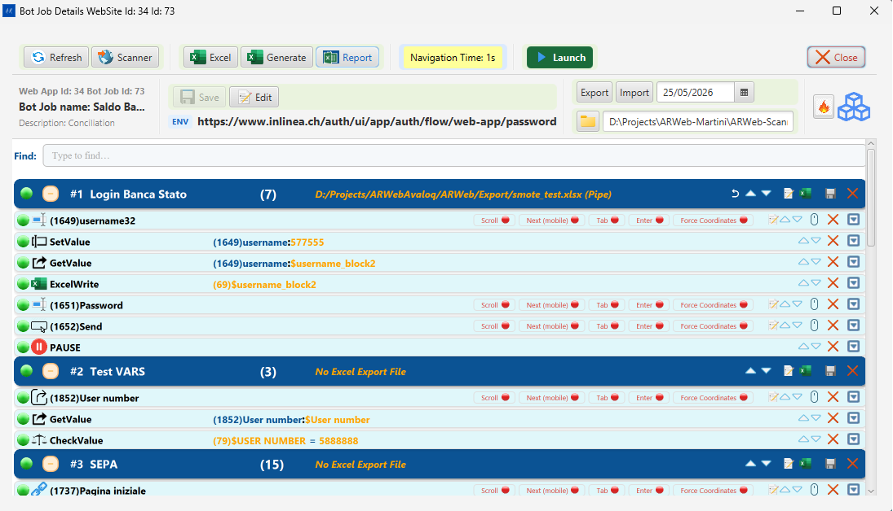

### Title Bar

The window title shows: `Bot Job Details WebSite Id: <orgId> Id: <botJobId>`

### Info Row (below toolbar)

| Element | Description |
|---|---|
| **Web App Id / Bot Job Id** | Internal database IDs for the current org and job |
| **Bot job name** | Editable name field (toggle with **Edit Bot Job**) |
| **Description** | Editable description (shown when Edit is active) |
| **Export / Import** | Buttons for exporting the job as a portable bundle or importing one |
| **Date** | Last modified date of the bot job |
| **ENV** | The currently selected environment URL (dropdown) |
| **Bot Job path** | Display-only path showing the working directory for this run |
| **Robot icon** | Visual indicator for the bot job type |

### Toolbar Buttons

| Button | Keyboard / Icon | What it does |
|---|---|---|
| **Refresh** | ↺ | Reloads the task instruction blocks from the database |
| **Scanner** | Browser icon | Opens the AR Web Factory window and launches the Selenium browser |
| **Excel** | Spreadsheet icon | Opens the Excel data file in the default application |
| **Generate** | Generate icon | Generates (or regenerates) the Excel file from current instructions |
| **Report** | Chart icon | Opens the last test execution HTML report in the browser |
| **Navigation Time: Ns** | Cycles 0→1→…→10→0 | Post-navigation wait. **Green** = 0 s, **Orange** = medium, **Red** = high |
| **Launch** | ▶ Play | Runs the Engine as an external `java.exe` process |
| **Close** | ✕ | Returns to the main Bot Job List window |

> The **Navigation Time** button changes color with the wait value: green (0 s), amber (1–4 s), red (5–10 s). Click it repeatedly to increase; it wraps back to 0 after 10 s.

### ENV / URL Bar

The ENV bar shows the active home URL for the current bot job. Click the dropdown to switch between configured environments for the parent Organization.

---

## 3. Task Instruction Blocks

The central area of the Bot Job View lists the recorded automation steps organized into **Blocks**.


### Block Header

Each block has a colored header row showing:

| Element | Description |
|---|---|
| **Play/Pause toggle** (●/◐) | Enables or disables the block for the next run |
| **# N** | Block sequence number |
| **Block name** | Name of the block (e.g., "Login Banca Stato") |
| **(count)** | Number of instructions in the block |
| **Excel path** | The associated Excel file path / "No Excel Export File" if not mapped |
| **▲ ▼** | Move block up or down in execution order |
| **📋 (copy)** | Duplicate the block |
| **🗑 (delete)** | Remove the block and all its instructions |
| **✕** | Collapse/expand the block |

### Instruction Row

Each instruction inside a block shows:

| Column | Description |
|---|---|
| **Type icon** | Visual indicator of the action type (click, input, setvalue, pause, etc.) |
| **ID** | Instruction database ID in parentheses, e.g., `(1649)` |
| **Description / Name** | The element's `definedName` or `someText` used for matching |
| **Send** | Badge indicating whether this instruction sends data to the Excel file |
| **Test (invalid)** | Validation state badge |
| **Error** | Error state badge |
| **Force Coordinates** | Blue badge; when lit the Engine uses screen coordinates as the primary locator |

---

## 4. Instruction Context Menu

Right-click on any instruction row in the Bot Job View to open the context menu.

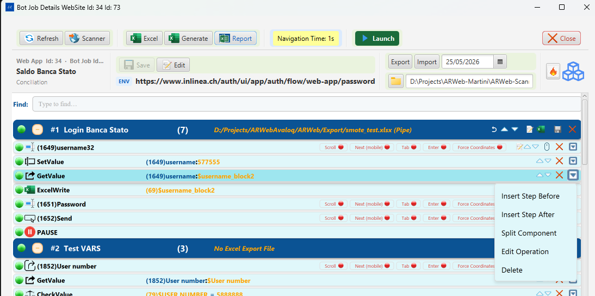

| Menu Item | What it does |
|---|---|
| **Insert Step Before** | Opens the Add/Update Operations dialog to insert a new instruction immediately before the selected row |
| **Insert Step After** | Opens the Add/Update Operations dialog to insert a new instruction immediately after the selected row |
| **Split Component** | Splits the current block into two blocks at the position of the selected instruction. The selected instruction and everything below it move into a new block; everything above remains in the original block. |
| **Edit Operation** | Opens the Add/Update Operations dialog pre-filled with the selected instruction's current values — allows you to change the command, variable, or web field |
| **Delete** | Removes the instruction from the block (confirmation required) |

---

## 5. Add/Update Operations Dialog

The **Add/Update Operations** dialog is used both for inserting new instructions and for editing existing ones. It opens from the instruction context menu (**Insert Step Before / After** or **Edit Operation**).

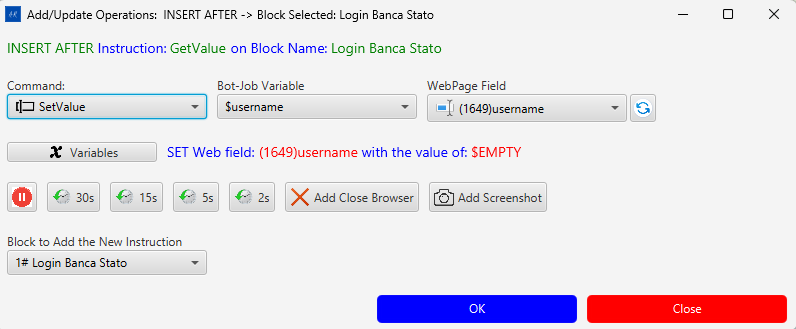

### Title Bar

The title bar shows the exact action and context, for example:
> `Add/Update Operations: INSERT AFTER -> Block Selected: Login Banca Stato`

Below the title, a green label confirms the insertion point:
> `INSERT AFTER Instruction: GetValue on Block Name: Login Banca Stato`

### Main Controls

| Control | Description |
|---|---|
| **Command** dropdown | The type of automation action to perform (see Command Types below) |
| **Bot-Job Variable** dropdown | The variable whose value will be used or stored by this instruction |
| **WebPage Field** dropdown | The recorded web element this instruction will act on |
| **↺ (refresh)** button | Reloads the WebPage Field list from the database |
| **Summary label** | Live preview of the operation, e.g., `SET Web field: (1649)username with the value of: $EMPTY` |

### Quick-Pause Buttons

Insert a wait instruction before the main action without opening a separate dialog:

| Button | Inserts a pause of |
|---|---|
| **30s** | 30 seconds |
| **15s** | 15 seconds |
| **5s** | 5 seconds |
| **2s** | 2 seconds |

### Extra Options

| Button | What it does |
|---|---|
| **Add Close Browser** | Appends a "close browser" instruction after this step |
| **Add Screenshot** | Appends a screenshot-capture instruction after this step |

### Block Selector

The **Block to Add the New Instruction** dropdown lets you choose which block the new instruction will be added to. Defaults to the block of the selected instruction.

### Confirm / Cancel

| Button | Action |
|---|---|
| **OK** | Saves the instruction and closes the dialog |
| **Close** | Cancels and discards changes |

---

### Command Types

The **Command** dropdown lists all available automation actions:

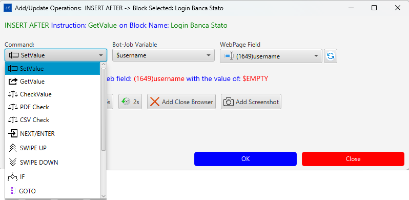

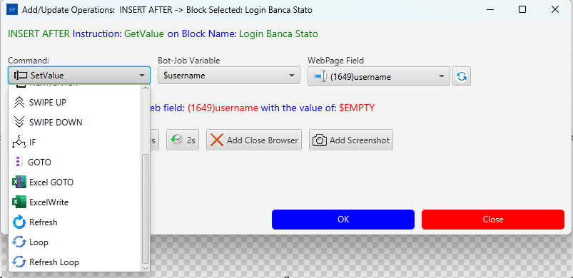

| Command | Description |
|---|---|
| **SetValue** | Types a variable value into a web field (input, select, textarea) |
| **GetValue** | Reads text from a web field and stores it in a variable |
| **CheckValue** | Asserts the web field's text equals the variable value |
| **PDF Check** | Reads and checks text from a PDF document |
| **CSV Check** | Reads and checks a value from a CSV file |
| **NEXT/ENTER** | Sends Enter or Tab to advance focus (e.g., submit a form) |
| **SWIPE UP** | Scrolls the page upward (mobile/touch gesture) |
| **SWIPE DOWN** | Scrolls the page downward |
| **IF** | Conditional branch — executes the next instruction only if a condition is met |
| **GOTO** | Jumps to a named label or block |
| **Excel GOTO** | Jumps to a row in the Excel data file |
| **ExcelWrite** | Writes a value directly into the Excel output file |
| **Refresh** | Reloads the current browser page |
| **Loop** | Repeats the enclosing block a fixed number of times |
| **Refresh Loop** | Reloads the page and repeats the block |

---

### Bot-Job Variables

Variables are named placeholders that carry data between instructions and the Excel file.

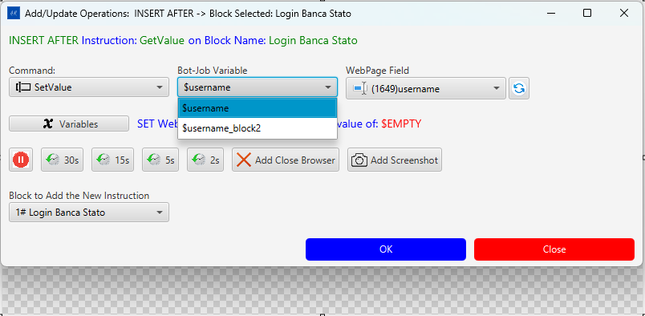

Click the **Variables** button to open the **New Variables** dialog and manage the variable list for this bot job.

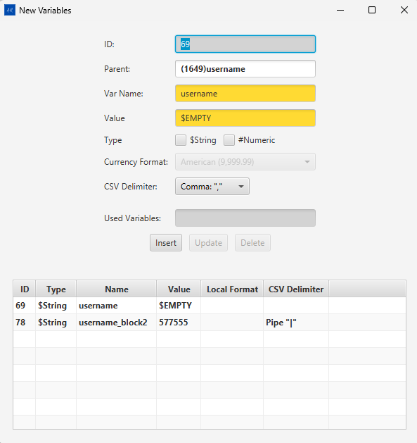

| Field | Description |
|---|---|
| **ID** | Auto-assigned database ID |
| **Parent** | The web field instruction this variable is linked to (e.g., `(1649)username`) |
| **Var Name** | Variable identifier used in instructions (e.g., `username`) — referenced as `$username` |
| **Value** | Default value; `$EMPTY` means the value comes from the Excel column at runtime |
| **Type** | `$String` (text) or `#Numeric` (number with optional currency format) |
| **Currency Format** | Decimal / thousand separator format for numeric values (e.g., `American (9,999.99)`) |
| **CSV Delimiter** | Delimiter used when the variable value contains multiple tokens (`Comma ","` / `Pipe "\|"` / etc.) |
| **Used Variables** | Read-only display of where this variable is referenced |

#### Variable Table

The table at the bottom of the dialog lists all variables for the current bot job:

| Column | Description |
|---|---|
| **ID** | Database ID |
| **Type** | `$String` or `#Numeric` |
| **Name** | Variable name |
| **Value** | Current default value |
| **Local Format** | Currency or number format (if numeric) |
| **CSV Delimiter** | Delimiter for multi-value variables |

Use **Insert** / **Update** / **Delete** buttons to manage variables.

---

### WebPage Fields

The **WebPage Field** dropdown lists all recorded web elements for the current bot job, identified by their database ID and defined name.

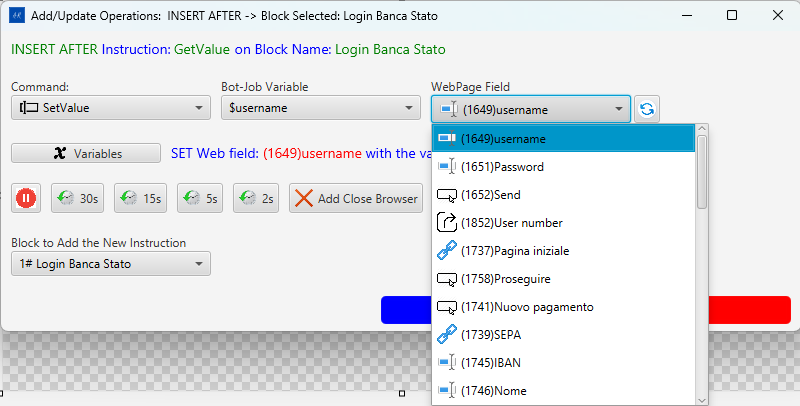

Each entry shows: `(ID)elementName` — for example `(1649)username`, `(1651)Password`, `(1652)Send`.

The element type icon to the left of each entry indicates whether it is an input field, a button, a link, or an output element.

---

### Variable Flow — How Data Moves Through a Bot Job

Variables are the bridge between the web page, the bot job instructions, and the Excel data file.

#### The Three-Way Link

Every variable connects three things:

```
Excel column  ←→  Bot-Job Variable  ←→  Web Field instruction
   $username            $username           (1649)username
```

- The **variable name** (e.g., `username`) is the same as the **Excel column header**.
- The **`$` prefix** (e.g., `$username`) is how the variable is referenced inside instructions.
- The **WebPage Field** (e.g., `(1649)username`) is the live DOM element the instruction acts on.

#### $EMPTY — Reading from Excel at Runtime

When a variable's **Value** is `$EMPTY`, the Engine reads the actual value from the matching Excel column when the instruction runs. This is the standard setup for data-driven tests.

```
Excel row: username = "john.doe"  →  SetValue types "john.doe" into (1649)username
Excel row: username = "jane.doe"  →  SetValue types "jane.doe" into (1649)username
```

#### GetValue — Capturing Data FROM the Page

**GetValue** reads the current text of a web field, stores it in a variable, and the Engine writes it into the corresponding Excel output column.

```
Web field (1852)User number = "12345"
   ↓  GetValue
Variable $username_block2 = "12345"
   ↓
Excel output column "username_block2" = "12345"
```

#### SetValue — Writing Data TO the Page

**SetValue** reads the variable's value (from Excel) and types it into the web field.

```
Excel input column "username" = "john.doe"
   ↓
Variable $username = "john.doe"
   ↓  SetValue
Web field (1649)username  ← types "john.doe"
```

#### Variables Across Blocks

Variables are scoped to the whole **bot job**, not a single block. A variable set by **GetValue** in block #1 can be consumed by **SetValue** in block #2 or #3 — this is how multi-page flows pass data between steps.

#### CSV Delimiter — Multi-Token Variables

When an Excel cell contains multiple values separated by a delimiter (`Pipe "|"` or `Comma ","`), the Engine iterates over each token across repeated loop executions:

```
Excel: username = "john.doe|jane.doe|bob.smith"  (Pipe delimiter)
  Loop 1  →  SetValue types "john.doe"
  Loop 2  →  SetValue types "jane.doe"
  Loop 3  →  SetValue types "bob.smith"
```

#### Command / Variable / Excel Summary

| Command | Variable role | Excel column role |
|---|---|---|
| **SetValue** | Supplies the value to type into the field | Input — filled before the run |
| **GetValue** | Receives the value read from the field | Output — filled during the run |
| **CheckValue** | Supplies the expected assertion value | Input — the assertion target |
| **ExcelWrite** | Supplies a value to write directly | Output — written without a web field |

---

## 6. Instruction Types

The following instruction types appear as colored icons in instruction rows:

| Icon color / label | Engine action |
|---|---|
| **Login** | Navigates to the home URL and waits for the page to load |
| **SetValue** | Types text into an input field (value comes from Excel) |
| **GetValue** | Reads a value from the page and stores it in the Excel output column |
| **ExcelWrite** | Writes a static or computed value into the Excel sheet |
| **CheckValue** | Asserts a page value matches an expected Excel value |
| **Click** / **Button** | Clicks a button or link |
| **Input Text** | Focuses and types into a text input |
| **PAUSE** | Waits for a configurable number of seconds |
| **Pagina iniziale** | Navigates back to the home URL |

> The exact set of available instruction types is defined by `ARConstantsEngine` and the Engine command vocabulary.

---

## 7. Component Panel

Click the **Component** toggle button in the Bot Job View toolbar to open the Component panel alongside the task blocks.

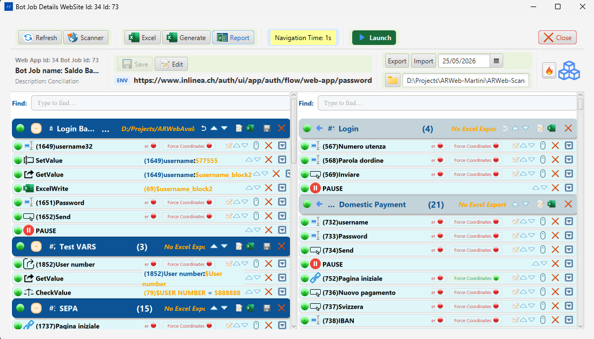

The Component panel shows **shared instruction components** — reusable instruction blocks that can be linked into multiple bot jobs.

| Panel element | Description |
|---|---|
| **Component list** | Tree of available components on the left |
| **Component detail** | Instructions inside the selected component on the right |
| **Link / Unlink** | Associate a component with the current bot job block |

Components allow common sequences (e.g., a login flow) to be defined once and shared across multiple bot jobs without duplicating instructions.

---

## 8. AR Web Factory — Overview

Click **Scanner** in the Bot Job View toolbar to open the **AR Web Factory** window.

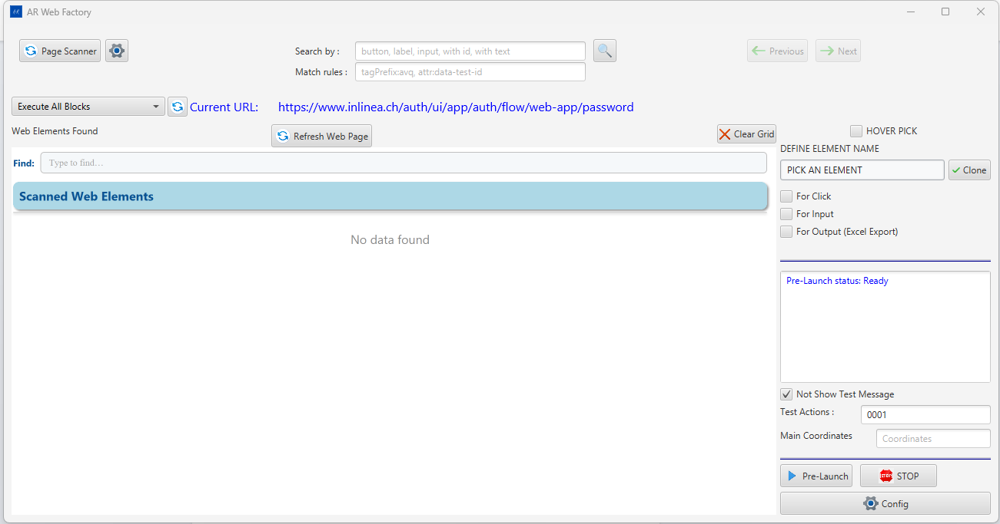

AR Web Factory is the recording and element management workspace. It has three areas:

| Area | Location | Purpose |
|---|---|---|
| **Toolbar** | Top bar | Search, URL display, Execute All Blocks, page actions |
| **Scanner Grid** | Left/center | Element blocks with picked elements from the live page |
| **Define Element Name panel** | Right | Element type picker, clone option, Pre-Launch controls |

---

## 9. AR Web Factory — Toolbar Reference


| Control | Description |
|---|---|
| **Page Scan...** button | Bulk-scans the live page using the default element types (`input, textarea, button, a, select, label`) plus any rules typed in **Match rules** — no need to fill in **Search by** |
| **⚙ (gear)** | Opens the OCR Configuration dialog |
| **Search by** field | CSS selectors or special keywords, comma-separated, that narrow down which elements are collected (see below) |
| **🔍** button | Triggers the scan using the custom terms in **Search by** plus **Match rules** |
| **Match rules** field | Extended matching rules for custom component libraries (see below) |
| **← Prev / Next →** buttons | Navigate between previously scanned pages |
| **Execute All Blocks** dropdown | Select a block to execute; runs all instructions in that block via the live browser |
| **Current URL** | Read-only display of the URL currently loaded in the Selenium browser |
| **Refresh Web Page** | Reloads the current page in the Selenium browser |
| **Clear Grid** | Empties the scanner grid (prompts if Hover Pick is active) |
| **Hover Pick** checkbox (top-right) | When checked, enables hover-pick accumulation — each element picked by hovering is added to the grid |

### Search by — Syntax Reference

The **Search by** field (placeholder: `button, label, input, with id, with text`) controls which DOM elements the scan script collects from the page. Values are comma-separated.

| Term | What it selects |
|---|---|
| `button` | All `<button>` elements |
| `input` | All `<input>` elements (any type) |
| `a` | All `<a>` (anchor/link) elements |
| `select` | All `<select>` (dropdown) elements |
| `label` | All `<label>` elements |
| `textarea` | All `<textarea>` elements |
| `div`, `span` | Container elements (only included in results if they have visible text) |
| `with id` | All elements that have an `id` attribute |
| `with name` | All elements that have a `name` attribute |
| `with test-id` | All elements that have a `test-id` attribute |
| `with text` | Only elements that carry visible text content |
| *(empty)* | Uses the default set: `input, textarea, button, a, select, label` |

**How to use:**
- The **Page Scan...** button always uses the default set plus any **Match rules** — leave **Search by** blank when you want to scan everything.
- The **🔍** button uses exactly what is typed in **Search by**. Use it when you want a targeted scan (e.g., type `with id` to see only elements with IDs).

### Match Rules — Syntax Reference

The **Match rules** field (placeholder: `tagPrefix:avq, attr:data-test-id`) extends the scan to include elements from custom component libraries that would otherwise be missed by plain CSS tag selectors. Values are comma-separated `keyword:value` tokens.

| Rule prefix | Example | Effect |
|---|---|---|
| `tagPrefix:` | `tagPrefix:avq` | Includes all elements whose tag name starts with `avq` — e.g., `<avq-button>`, `<avq-input>` |
| `tagSuffix:` | `tagSuffix:-button` | Includes all elements whose tag name ends with `-button` |
| `attr:` | `attr:data-test-id` | Includes all elements that have the named attribute (`data-test-id`) regardless of tag |
| `attrPrefix:` | `attrPrefix:data-` | Includes elements with any attribute whose name starts with `data-` |

**Typical use cases:**
- **Avaloq / AVQ applications**: `tagPrefix:avq` captures the full component set (`avq-input`, `avq-table-cell`, etc.)
- **Test automation attributes**: `attr:data-test-id` or `attr:data-cy` adds test-id–tagged elements on top of regular interactive elements
- **Angular Material**: combine with `tagPrefix:mat-` to include Material Design custom elements

Both **Page Scan...** and **🔍** pass the Match rules to the scan engine alongside the search terms.

### Page Scanning — How It Works Internally

When a scan is triggered the `searchListAsync` script is injected into the live browser page and:

1. Traverses **iframes** (same-origin only) — elements inside `<iframe>` documents are collected and their XPaths are prefixed with the iframe's XPath.
2. Traverses **Shadow DOM** (open shadow roots only) — custom web components are discovered and their `shadowHost` selector is recorded.
3. Traverses the **main document** — all elements matching the search terms are collected.
4. **Deduplicates** by XPath — elements at identical coordinates with the same XPath are merged; the one with richer attributes (e.g., `aria-label`) is kept.
5. **Sorts** the result list in element-type order: `input → textarea → button → a → select → label → span → div`.
6. Post-processes labels: `<div>` elements that have visible text are reclassified as `label`; Angular `mat-label` associations are resolved; table cells normalize their `someText`.
7. Returns the full list to Java as JSON; the Scanner Grid is populated with grouped element blocks.

---

## 10. Scanner Grid — Element Blocks

Elements are grouped into blocks by HTML element type. Each block has:

| Control | Description |
|---|---|
| **−/+** collapse toggle | Collapses or expands the block |
| **#N** | Block order number |
| **Type icon + label** | Element type: Input Text / Button / Link / Output |
| **(N)** | Count of elements in this block |
| **Prev / Next** | Pagination (shown when count > rows-per-page) |
| **✕** | Removes the entire block from the grid |

### Grid Toolbar (above all blocks)

| Button | WebSocket verb | Description |
|---|---|---|
| **Insert All Elements** | `SEND_ALL_ELEMENTS_DTO` | Inserts all grid elements into the database as instructions |
| **Update All Elements** | `UPDATE_ALL_ELEMENTS_DTO` | Updates existing database records for all grid elements |
| **Keep All** | — | Ticks all Keep checkboxes in the grid |
| **Clear Keeps** | — | Unticks all Keep checkboxes |
| **Delete Unchecked (N)** | — | Removes all rows that are NOT marked Keep; N = count to be removed |
| *(unlabelled)* | — | Rows-per-page selector (5 / 10 / 20 / 50) |

---

## 11. Scanner Grid — Per-Row Controls

Each element row (from left to right):

| Control | Description |
|---|---|
| **Keep checkbox** | Marks the element as "keep" — survives Delete Unchecked |
| **Element name** | Display label. Priority chain: `clientNamed` → `definedName` → `someText` → tag name |
| **Force badges** | Compact badge cycling through locator strategies: **F** = Force XPath, **E** = Force Exact text, **T** = Force contains-text, **N** = Normal (default), **S** = Shadow DOM |
| **Pick** (purple icon) | `DETAILS_ELEMENT_DTO` — sends the element back to the backend for a details preview |
| **Edit** (pencil) | Enters inline rename mode; type a new `clientNamed` value and press Enter |
| **Save** (disk) | `NEW_ELEMENT_DTO` — saves this single element to the database as an instruction |
| **Test Input** (keyboard) | `TEST_INPUT_DTO` — sends a keystroke to the live element (inputs only) |
| **Test Click** (cursor) | `TEST_CLICK_DTO` — clicks the element in the live browser |
| **✕** | Removes this row from the grid (does not delete from database) |

### Renaming an Element

1. Click the **Edit** (pencil) icon.
2. The name field becomes an editable input.
3. Type the new name → press **Enter** or click the **Save** disk icon.
4. The value is stored as `clientNamed` and overrides `definedName`/`someText` in the display and in the saved instruction.

---

## 12. Define Element Name Panel

The right panel in AR Web Factory defines how a picked element is categorized before saving.

| Control | Description |
|---|---|
| **PICK AN ELEMENT** section | Radio buttons / selection for the purpose of the pick |
| **For Click** | Marks the element as a clickable target |
| **For Input** | Marks the element as a text input field |
| **For Output (Excel Export)** | Marks the element as a read value that will be written to the Excel output column |
| **✓ Clone** checkbox | When checked, the next pick clones the currently selected instruction instead of creating a new one |

After selecting the type, hover over the element in the Selenium browser and click to pick it. The element appears in the corresponding block in the grid.

---

## 13. Pre-Launch Panel

The Pre-Launch panel is at the bottom-right of AR Web Factory.


| Control | Description |
|---|---|
| **Pre-Launch status** | Shows the current execution state: `Ready` / `Running` / `Done` / error message |
| **Not Show Test Message** checkbox | Suppresses intermediate test status dialogs during the run |
| **Test Actions** | Number of actions to execute (0 = all) |
| **Main Coordinates** | Override coordinates field (leave empty for automatic) |
| **Pre-Launch ▶** button | Starts the automation run **inside** the Scanner process using the AR Web Engine |
| **■ STOP** | Stops an active Pre-Launch run |
| **⚙ Config** | Opens the Configuration panel |

**Pre-Launch vs Launch** — both execute the same bot job instructions via the AR Web Engine. Pre-Launch runs the Engine embedded inside the Scanner process (useful during development to see logs in one place). Launch spawns a separate `cmd.exe / java.exe` process (used for production/CI runs).

---

## 14. OCR Configuration

Click the **⚙ gear** button in the AR Web Factory toolbar.

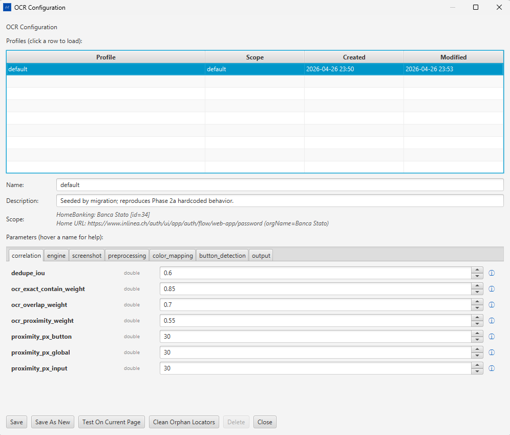

### Profile Table

| Column | Description |
|---|---|
| **Profile** | Profile name (e.g., "default") |
| **Scope** | Org + Home URL this profile applies to |
| **Created** | Creation timestamp |
| **Modified** | Last save timestamp |

Click a row to load the profile into the form below.

### Profile Metadata

| Field | Description |
|---|---|
| **Name** | Profile identifier |
| **Description** | Free-text note |
| **Scope** | Auto-filled from the active Organization and Home URL |

### Parameter Tabs

| Tab | Purpose |
|---|---|
| `correlation` | Weights and thresholds for OCR-to-DOM text matching |
| `engine` | OCR engine selection and confidence threshold |
| `screenshot` | Screenshot capture area and scaling |
| `preprocessing` | Image pre-processing (binarization, contrast, deskew) |
| `color_mapping` | Color-based element type classification |
| `button_detection` | Button boundary detection parameters |
| `output` | Debug output and overlay rendering options |

Hover over any parameter label to see its inline help tooltip (ⓘ).

#### Key Correlation Parameters

| Parameter | Type | Default | Description |
|---|---|---|---|
| `dedupe_iou` | double | 0.6 | IoU threshold for deduplicating overlapping OCR detections |
| `ocr_exact_contain_weight` | double | 0.85 | Match score when OCR text exactly contains DOM text |
| `ocr_overlap_weight` | double | 0.7 | Score for partial text overlap |
| `ocr_proximity_weight` | double | 0.55 | Score based on spatial proximity |
| `proximity_px_button` | double | 30 | Pixel radius for button proximity matching |
| `proximity_px_global` | double | 30 | Global proximity radius |

### Profile Actions

| Button | Action |
|---|---|
| **Save** | Overwrites the current profile with edited values |
| **Save As New** | Creates a new profile with a new name |
| **Test On Current Page** | Runs OCR against the active page; opens OCR Test Results |
| **Clean Orphan Locators** | Removes stored OCR locators with no matching DOM element |
| **Delete** | Deletes the selected profile |
| **Close** | Closes the dialog without saving |

---

## 15. OCR Test Results

After clicking **Test On Current Page** in OCR Configuration.

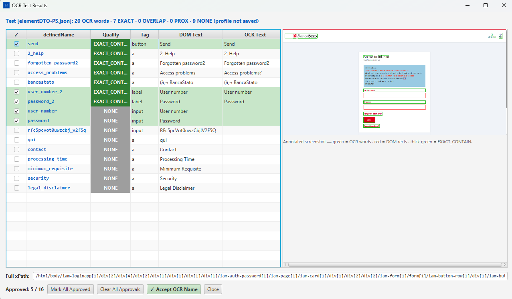

### Results Table (left panel)

| Column | Description |
|---|---|
| **✓** checkbox | Select elements to approve |
| **definedName** | The stored element name |
| **Quality** | Match quality badge |
| **Tag** | HTML element type (`button`, `a`, `label`, `input`) |
| **DOM Text** | Text read directly from the DOM |
| **OCR Text** | Text detected by the OCR engine from the screenshot |

#### Quality Badges

| Badge | Color | Meaning |
|---|---|---|
| `EXACT_CONT...` | Green | OCR text exactly contains DOM text — high confidence match |
| `NONE` | Grey | No OCR match found for this element |

### Annotated Screenshot (right panel)

The screenshot taken at test time is shown with colored overlays:

| Overlay | Color | Meaning |
|---|---|---|
| OCR word bounding boxes | Green | Text regions detected by OCR |
| DOM element rectangles | Red | DOM element bounding boxes |
| Exact-contain matches | Thick green | Elements with `EXACT_CONTAIN` quality |

The **Full xPath** field at the bottom shows the XPath of the currently selected row.

### Approval Controls

| Control | Action |
|---|---|
| **Approved: N / M** | Running count of approved vs total |
| **Mark All Approved** | Sets all rows as approved |
| **Clear All Approvals** | Removes all approval marks |
| **✓ Accept OCR Name** | Stores the OCR-detected text as the `clientNamed` override for approved elements and persists them |
| **Close** | Closes the dialog |

---

## 16. WebSocket Message Quick Reference

AR Web Factory communicates with the Java backend over a WebSocket connection. The following verbs are relevant to the Scanner Grid.

### Outbound (Frontend → Backend)

| Verb | Trigger | Description |
|---|---|---|
| `SEND_ALL_ELEMENTS_DTO` | Insert All Elements | Inserts all grid elements as instructions in the database |
| `UPDATE_ALL_ELEMENTS_DTO` | Update All Elements | Updates existing instruction records with current grid data |
| `NEW_ELEMENT_DTO` | Save (per row) | Inserts or updates a single element |
| `DETAILS_ELEMENT_DTO` | Pick button | Requests full detail preview for one element |
| `TEST_INPUT_DTO` | Test Input button | Sends a test keystroke to the live element |
| `TEST_CLICK_DTO` | Test Click button | Sends a click to the live element |
| `CLEAR_HOVER_PICK_FILE` | Clear Grid (HP mode) | Tells the backend to truncate the cumulative `elementDTO-HP.json` file |

### Inbound (Backend → Frontend)

| Verb | Description |
|---|---|
| `scannerGrid` | Pushes a batch of scanned elements to populate the grid |
| `mobileScannerGrid` | Pushes elements from a mobile scan session |
| `SEARCH_TOOL` | Search/filter result payload for the Scanner search box |
| `addPickOne` | Adds a single hover-picked element to the grid |
| `mobile-return-server` | Response payload from a mobile companion session |

---

*For the main window, organizations, configuration panel, launch/pre-launch, clone, export/import, reports, backup/restore, and OCR — see **Part 1**.*
